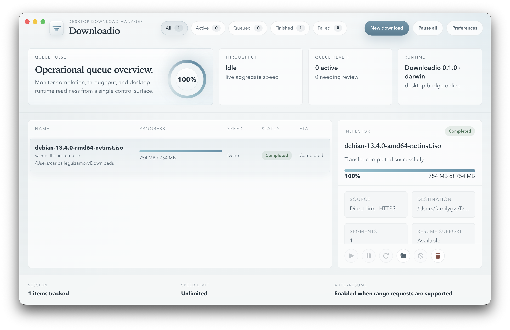

# Downloadio

`Downloadio` is a desktop download manager built with `Angular`, `Electron`, and `Node.js`.

It is designed as a calm, native-feeling desktop app with a restrained Transmission-inspired interface and a real download engine behind it.



## Current state

The project is already past the shell/mockup stage. Today it includes:

- a desktop renderer with a polished queue, inspector, toolbar, and status bar
- a secure Electron bridge exposed through `preload.cjs`
- real HTTP/HTTPS downloads handled in the Electron main process
- progress, speed, ETA, completion, failure, cancel, pause, and resume flows
- queue persistence between launches
- delete with file cleanup
- open-download-location support for completed transfers
- a componentized Angular UI instead of a single monolithic `app.html`

## What works now

### Desktop workflow

- add a new download from a direct `http` or `https` URL
- start immediately from the composer
- inspect status, transfer speed, ETA, and latest event
- pause and resume active downloads
- retry failed or cancelled downloads
- cancel an active transfer
- delete a record and remove downloaded data from disk
- reveal the saved file location from the inspector when the download is complete

### Engine behavior

- downloads are saved to the system Downloads folder by default
- partial files are stored as `.downloadio-part`
- completed transfers are renamed into their final file name
- pause/resume keeps partial data and resumes with range requests when supported
- restored active items are normalized back to queued on reopen

### UI behavior

- header / body / footer layout in the inspector
- scrollable content areas for the downloads list and inspector body
- icon-based inspector actions
- overflow-safe destination rendering with ellipsis and tooltip
- queue overview cards with a live animated completion meter

## Recommended runtime

Use an LTS Node release:

- `Node.js 22.x` recommended
- `Node.js 24.x` acceptable

Angular 21 does not support odd-numbered `Node.js 25.x`.

## Install

```bash
npm install
```

## Run

### Web renderer only

```bash
npm run start:web
```

### Desktop app

```bash
npm run start:desktop
```

If port `4200` is already in use:

```bash
DOWNLOADIO_RENDERER_PORT=4300 npm run start:desktop
```

### Preview desktop against a production build

```bash
npm run build:web
npm run preview:desktop
```

## Scripts

```bash
npm run start:web
npm run start:desktop
npm run build:web
npm run preview:desktop
npm test -- --watch=false
```

## Project structure

```text
Downloadio/
├── artifacts/
│   └── downloadio_0.1.0.png
├── electron/
│   ├── download-manager.mjs
│   ├── main.mjs
│   └── preload.cjs
├── src/
│   ├── app/
│   │   ├── components/
│   │   │   ├── download-inspector/
│   │   │   ├── downloads-list/
│   │   │   ├── queue-overview/
│   │   │   └── status-bar/
│   │   ├── data/
│   │   ├── models/
│   │   ├── services/
│   │   ├── utils/
│   │   └── validators/
│   └── types/
├── tools/
│   ├── dev.mjs
│   └── preview.mjs
└── package.json
```

## Important implementation notes

- persistence is currently renderer-side and intended to move to `SQLite`
- the engine is focused on direct downloads first, not full JDownloader-style hoster/plugin parity
- resume still depends on server support for HTTP range requests

## Next steps

- move persistence into Electron + SQLite
- add preferences for destination, concurrency, and limits
- improve queue management and scheduling
- expand desktop integrations and packaging
